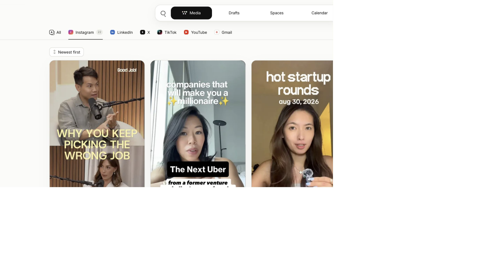
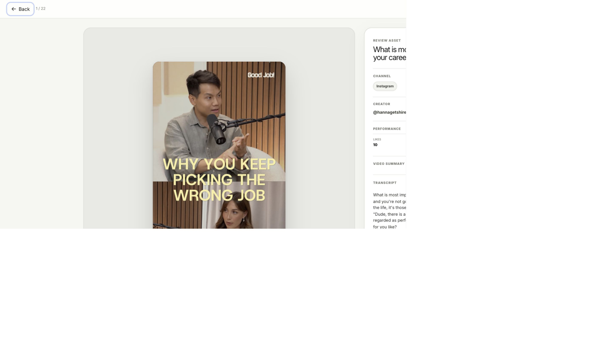
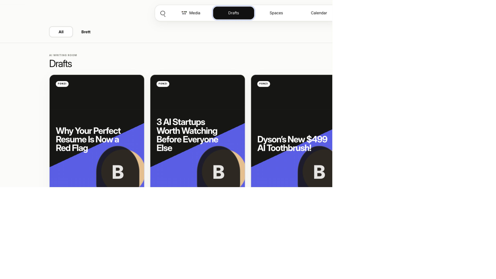
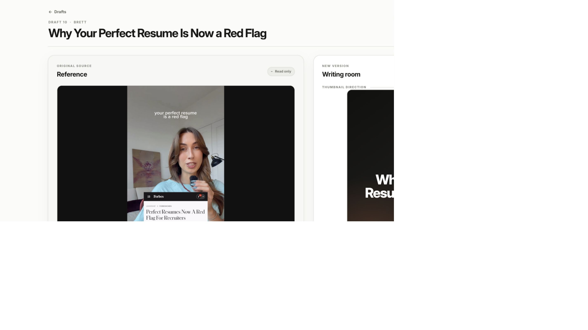
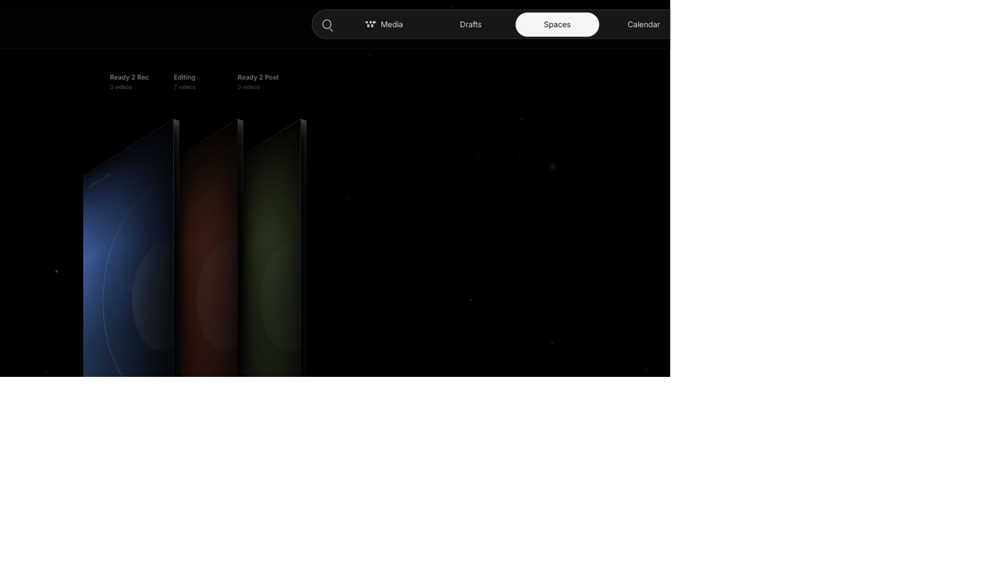

<div align="center">

# Fonzi Signal

### Turn proven social videos into reviewable Fonzi scripts without losing the original source.

Fonzi Signal is a content workspace built for the Fonzi team. It brings source discovery, AI-assisted drafting, human review, and production handoff into one place.

</div>



## What this does

Strong content ideas usually arrive as scattered links, saved posts, transcripts, and notes. Fonzi Signal turns that mess into a simple working loop:

1. **Find a useful source** in the Media library.
2. **Review the original** video, performance, and transcript.
3. **Create a Fonzi draft** with AI.
4. **Edit beside the source** so the new script stays grounded in what inspired it.
5. **Move approved work forward** into the production queue.

The original source remains attached throughout the process. Signal does not publish anything automatically. A person always decides what moves forward.

## How it works

| Step | What you do | What Signal handles |
|---|---|---|
| **1. Discover** | Browse saved social videos and open anything worth studying. | Keeps the video, creator, transcript, original link, and performance together. |
| **2. Decide** | Create a draft or remove the source from the active library. | Creates one linked draft and keeps the source record intact. |
| **3. Draft** | Review and edit the proposed hook, body, CTA, and thumbnail direction. | Writes a first version in the background and notifies you when it is ready. |
| **4. Review** | Compare the new script with the original and make the final call. | Autosaves edits and keeps a record of generated versions. |
| **5. Produce** | Mark the script ready to record. | Moves the work into its next production space. |

## 1. Browse the source library

The Media workspace is the inbox for promising content. You can browse visual cards, preview videos, switch sound on or off, search, sort by date, and filter by channel.

Each card keeps the useful context visible: creator, date, engagement, runtime, and the beginning of the spoken script.

## 2. Review before you create

Opening a source gives you the full picture before AI touches it. The original video stays beside its creator, performance, link, summary, and transcript.



From here, there are two clear choices:

- **Create draft** starts a new Fonzi version.
- **Kill** removes the source from the active library without deleting its record.

## 3. See every draft in one place

The Drafts workspace shows what AI is writing, what is ready, and what needs attention. Finished drafts are easy to scan by title, speaker, account, and platform.



Creating the same source twice does not create duplicate work. Signal returns to the draft already linked to that source.

## 4. Write beside the original

The writing room keeps the source on the left and the new Fonzi version on the right. That makes it easy to borrow the useful idea without copying the original script.



The editor includes:

- thumbnail direction and thumbnail hook
- spoken hook, body, and CTA
- speaker, publishing account, and platform
- live word count and autosave status
- generation history and checked sources
- a **Generate again** option when a fresh pass is needed

## 5. Move approved work into production

Once a script is approved, **Ready 2 Rec** moves it out of drafting and into the production board.



The Spaces view groups work into three stages:

- **Ready 2 Rec** for locked scripts
- **Editing** for captured footage in progress
- **Ready 2 Post** for completed exports

## What Signal protects

- **The original is never overwritten.** Source video and transcript stay read-only.
- **Every draft stays linked to its source.** The team can always see where an idea came from.
- **One source creates one draft.** Repeated clicks do not create duplicates.
- **Human review stays in charge.** AI can write, but it cannot approve or publish.
- **Changes are recoverable.** Edits autosave and generated versions remain in the history.
- **Nothing posts by itself.** Signal ends at production handoff.

## What works today

The Instagram workflow works from source review through drafting and production handoff. Search, sorting, video preview, transcripts, AI drafting, autosave, notifications, draft history, and production stages are all represented in the current workspace.

## Current boundaries

Signal is an internal, local-first workspace rather than a public multi-user product.

- Instagram is the active source channel today.
- LinkedIn, X, TikTok, YouTube, Gmail, and Calendar are visible placeholders for future workflows.
- The app helps prepare content, but it does not publish to social platforms.
- Moving work into later production stages is still being finished in the interface.

<details>
<summary><strong>Technical setup for developers</strong></summary>

### Built with

Next.js, TypeScript, React, SQLite, and the OpenAI Responses API.

### Run locally

```bash
git clone https://github.com/TJCHOW22/fonzi-signal.git
cd fonzi-signal
npm install
npm run dev
```

Open `http://localhost:3211`.

Draft generation needs an `OPENAI_API_KEY` or `CODEX_API_KEY`. Local content and media live outside Git in `data/`, so a fresh clone starts without Fonzi's private source library.

### Verify the project

```bash
npm run test:media-drafts
npm run build
```

</details>
