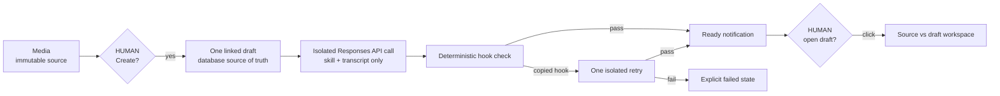

# fonzi-signal - system map

The app has two visible surfaces, Media and Drafts. A human starts the flow;
the bounded generation stages can then advance without opening or publishing
the result.

Create returns to Media immediately. The converted source leaves the active
grid but stays in the database and on the draft page. Repeated Create requests
reuse the same draft. Global controls read persisted run state and notifications
from the draft APIs.

The local SQLite database owns media, draft content, generation runs, model and
prompt provenance, immutable revisions, production stage, and notification
history. Generation uses no Codex session, workspace context, MCP tools, or
stored model response.
