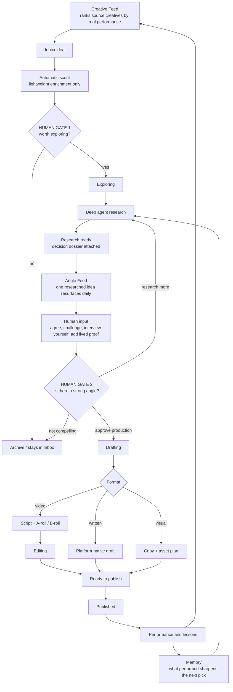
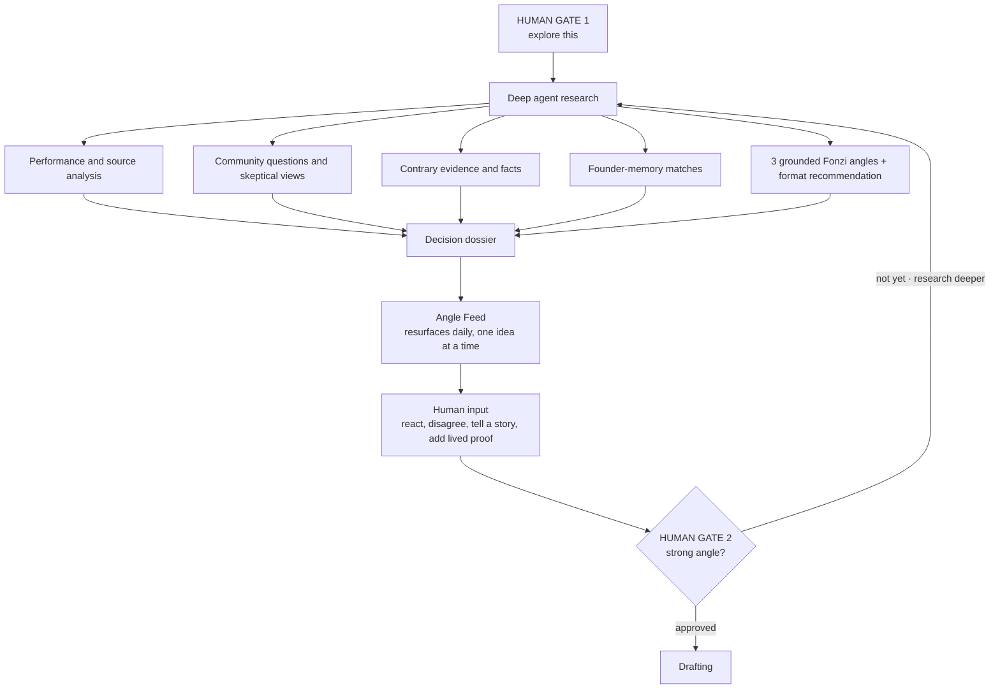

# fonzi-signal — system map

The content system as built, with the two human decisions made explicit.
Companion to `DIRECTION.md`. Last verified 2026-08-17.

The single idea this map encodes: **the agent earns the idea more context, the human gives it a point of view.** Nothing advances a stage on its own.

---

## 1. The whole system

Two feeds, two human gates, one learning loop.

**Why two gates and not one.** The original model had a single "worth investing in?" node doing two jobs at once: authorizing research and authorizing production. Those are different decisions with different costs. Gate 1 spends agent time. Gate 2 spends yours.

---

## 2. Inside the Angle Feed loop

The Creative Feed optimizes for *what deserves attention*. The Angle Feed optimizes for *what deserves an opinion*.

**Hard rule on the research step:** the agent never invents an opinion, a number, or a quote. Missing evidence gets reported as missing.

---

## 3. What each stage is allowed to do

| Stage | Actor | Advances on its own | Notes |
|---|---|---|---|
| Creative Feed | agent | yes | ranking only, never promotes an idea |
| Inbox | — | no | uncommitted signals |
| Automatic scout | agent | yes | lightweight enrichment, not deep research |
| Gate 1 | human | — | authorizes agent time |
| Deep research | agent | yes | writes the dossier, nothing else |
| Angle Feed | agent | yes | surfaces, never approves |
| Human input | human | — | the irreplaceable part |
| Gate 2 | human | — | authorizes production |
| Drafting → Published | mixed | no | human approval at publish |
| Performance and lessons | agent | yes | feeds ranking and memory |
